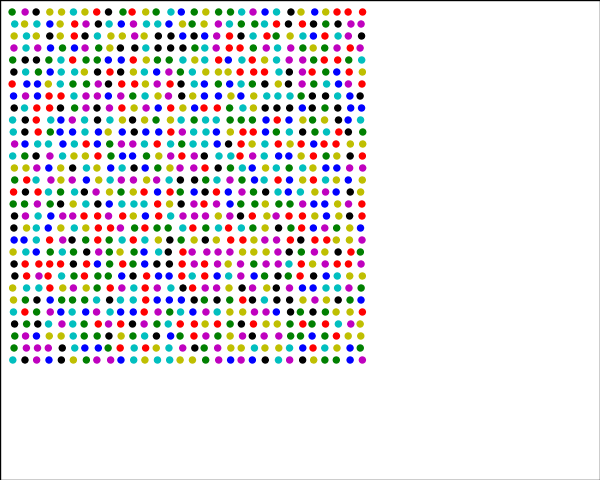

# dem

  

A simple 2D discrete element method implementation.

## Contents

This DEM code includes:

- Nearest-neighbor algorithm
- Hertz collision model
- Verlet time integration
- Core routines are deferred to Numba

## Examples

Running a specific case requires to write an application in `dem/app`, and then to register it in `dem/app/app.py`. You can than call it from root directory doing `python start.py <app_name>`. Multiple app examples are provided in the dedicated directory, to be copied and adapted. Below are some simple sanity checks and a bit more advanced examples of what is possible with this small library.

| **`gravity`**                                             | **`gravity-tilted`**                                           | **`obstacle`**                                            |
| :-------------------------------------------------------: | :------------------------------------------------------------: | :-------------------------------------------------------: |
|    |  |   |
| **`dam-break`**                                           | **`silo`**                                                | **`?`**  |
|  |  |          |
